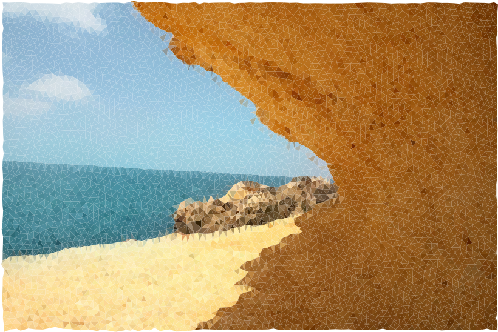
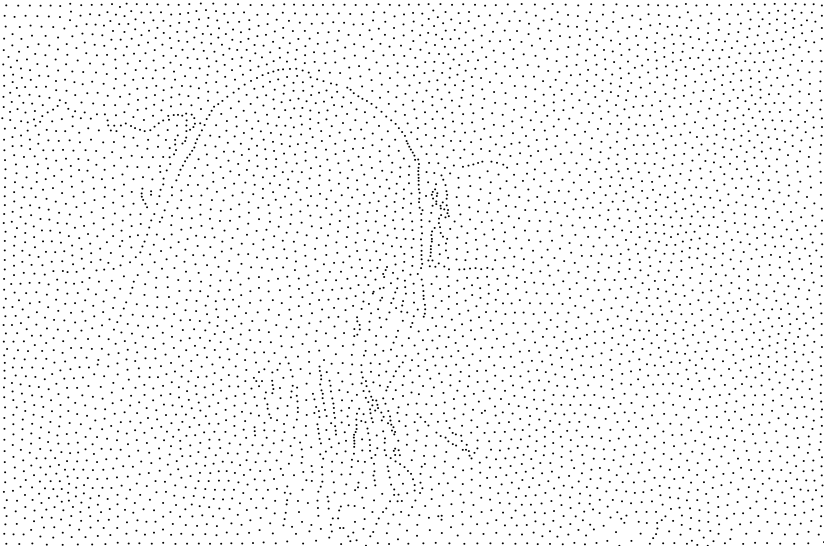
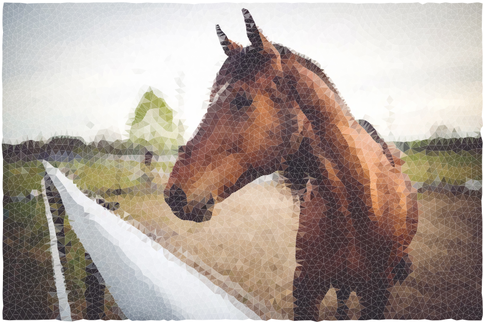
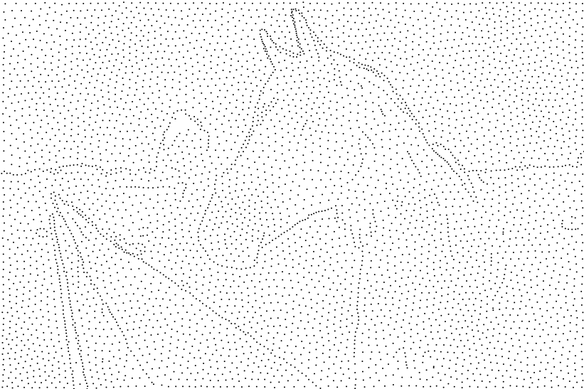

# Semi-Isotropic Triangular Image Lowpoly

A fast lightweight implement of semi-isotropic triangular image lowpoly via centroid voronoid diagram.

|                           |                                                         |      |
| ------------------------------------------------ | ------------------------------------------------------- | ---- |
|   |   |       |
|   |       |  |
|   |      |       |

## Denpendencies
- eigen
- stb
- [voronoi](https://github.com/JCash/voronoi)
